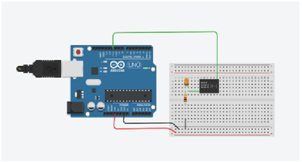

## Theory

Relays are electrically operated switches that allow microcontrollers to control high voltage or high current circuits. They work using an electromagnet to mechanically operate a switch. A relay has three main pins for the switch - Normally Open (NO), Normally Closed (NC), and Common (COM), and two pins for the coil.

When voltage is applied to the coil, it generates a magnetic field that either makes or breaks the connection between COM and NO/NC. In this experiment, we use an Arduino Uno to control the relay by sending HIGH/LOW signals to its input pin. The relay, in turn, controls an LED connected through the NO and COM pins. This setup demonstrates basic relay switching using digital output from a microcontroller.
Components Used:
- Arduino Uno
- Relay Module
- LED (Orange)
- 1kΩ Resistor
- Jumper wires
- Breadboard

